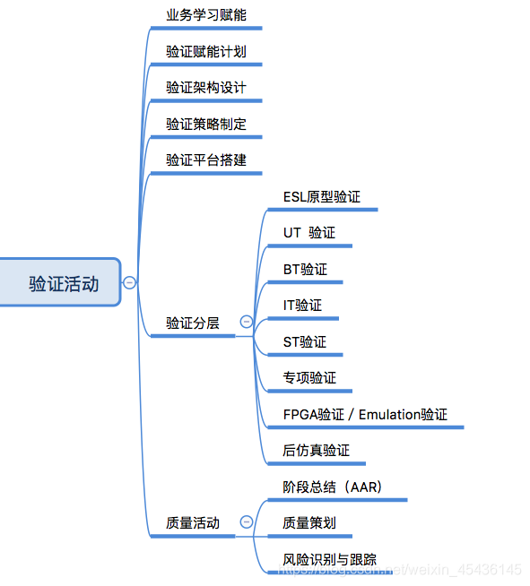

##DACVinci架构熟悉

## Ai core指令集及演讲逻辑

## ISG&Generator上手引导

## DaVinci验证引导

## 培训材料共享

## 工具及基本技能
- c++
- vcs  

## 验证活动

##表格
|name|age|
|----|----|
使用 <kbd>Ctrl</kbd>+<kbd>Alt</kbd>+<kbd>Del</kbd> 重启电脑

